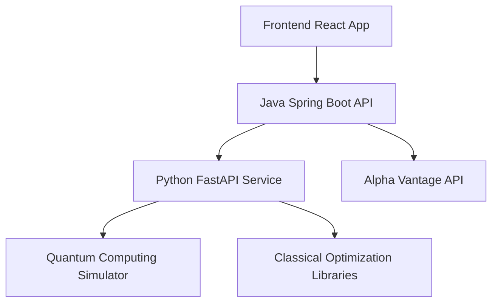

# Comprehensive Testing Strategy

This document outlines the complete testing strategy for the QuantumFPO application, covering all backend and frontend components with full integration testing.

## 🏗️ Testing Architecture

### Test Levels

1. **Unit Tests** - Individual component/function testing
2. **Integration Tests** - Service-to-service communication
3. **API Tests** - RESTful endpoint testing
4. **End-to-End Tests** - Complete user workflow testing
5. **Performance Tests** - Load and stress testing

### Technology Stack

- **Python**: pytest, FastAPI TestClient, unittest.mock, pytest-asyncio
- **Java**: JUnit 5, Mockito, Spring Boot Test, MockMvc
- **Frontend**: Jest, React Testing Library
- **Integration**: TestContainers (future), service orchestration

## 📁 Test Structure

```
backend/
├── src/test/python/
│   ├── test_classic_portfolio_opt.py      # Classical optimization unit tests
│   ├── test_hybrid_portfolio_opt.py       # Hybrid optimization unit tests  
│   ├── test_portfolio_api.py              # FastAPI endpoint tests
│   └── test_integration_e2e.py            # End-to-end integration tests
├── src/test/java/
│   ├── com/quantumfpo/stocks/controller/
│   │   └── StockControllerEnhancedTest.java # Enhanced controller tests
│   └── com/quantumfpo/stocks/service/
│       └── PythonApiServiceTest.java       # REST client service tests
frontend/
└── test/
    └── frontend.test.jsx                   # React component tests
```

## 🐍 Python Test Suite

### Coverage Areas

#### test_portfolio_api.py (600+ lines)
- **Health Endpoints**: `/health`, `/api/health` with status verification
- **Classical Optimization**: `/api/optimize/classical` with various portfolios
- **Hybrid Optimization**: `/api/optimize/hybrid` with quantum simulator
- **Async Endpoints**: Concurrent request handling
- **Error Handling**: Invalid data, malformed requests, missing parameters
- **CORS**: Cross-origin resource sharing validation
- **Performance**: Large dataset handling, response times
- **Edge Cases**: Empty portfolios, single asset, extreme values

#### test_integration_e2e.py (300+ lines)
- **Service Orchestration**: Starting/stopping FastAPI server
- **Cross-Service Communication**: Java-to-Python API calls
- **Concurrent Testing**: Multiple simultaneous requests
- **Resiliency Testing**: Error recovery, timeout handling
- **Load Testing**: Performance under concurrent load

### Running Python Tests

```bash
# All Python tests with coverage
cd backend
python -m pytest src/test/python/ --cov=src/main/python --cov-report=html -v

# Specific test suites
python -m pytest src/test/python/test_portfolio_api.py -v
python -m pytest src/test/python/test_integration_e2e.py -v -m "integration"
```

## ☕ Java Test Suite

### Coverage Areas

#### PythonApiServiceTest.java (400+ lines)
- **REST Client Testing**: Mock RestTemplate interactions
- **Health Check Integration**: Python API health verification
- **Optimization Endpoints**: Classical and hybrid optimization calls
- **Error Handling**: Network failures, API errors, timeouts
- **Data Transformation**: Request/response mapping
- **Circuit Breaking**: Service resilience patterns

#### StockControllerEnhancedTest.java (400+ lines)
- **Controller Layer**: All REST endpoints with MockMvc
- **Service Integration**: AlphaVantageService and PythonApiService mocking
- **Request Validation**: Input validation and error responses
- **Authentication**: Security context testing
- **Exception Handling**: Global exception handling verification

### Running Java Tests

```bash
cd backend

# All Java tests with coverage
mvn clean test jacoco:report

# Specific test categories
mvn test -Dtest="*Test" -Dgroups="unit"
mvn test -Dtest="*Integration*" -Dgroups="integration"

# Test reports
mvn surefire-report:report-only
```

## ⚛️ Frontend Test Suite

### Coverage Areas

- **Component Testing**: React component behavior
- **User Interactions**: Click events, form submissions
- **State Management**: Redux/Context state changes
- **API Integration**: Mock API response handling
- **Routing**: Navigation and route protection

### Running Frontend Tests

```bash
cd frontend

# All frontend tests with coverage
npm test -- --coverage --watchAll=false

# Watch mode for development
npm test
```

## 🔄 CI/CD Pipeline

### GitHub Actions Workflows

#### 1. Comprehensive CI/CD (`comprehensive-ci-cd.yml`)
- **Multi-Stage Pipeline**: Parallel test execution
- **Matrix Strategy**: Multiple test environments
- **Quality Gates**: Coverage thresholds and failure conditions
- **Artifact Management**: Test results and coverage reports
- **Security Scanning**: Bandit, Safety, npm audit
- **Deployment**: Automated staging deployment

#### 2. Standalone Workflows
- **Python Tests** (`python-tests.yml`): Standalone Python validation
- **Java Maven** (`maven.yml`): Java build and test pipeline
- **Node.js** (`node.js.yml`): Frontend build and test pipeline

### Workflow Triggers

```yaml
on:
  push:
    branches: [ main, develop ]
  pull_request:
    branches: [ main, develop ]
  workflow_dispatch:  # Manual trigger
```

## 🏃‍♂️ Running Tests Locally

### Prerequisites

```bash
# Python dependencies
cd backend/src/main/python
pip install -r requirements.txt
pip install pytest pytest-cov pytest-mock pytest-asyncio httpx

# Java dependencies (handled by Maven)
cd backend
mvn clean compile

# Frontend dependencies
cd frontend
npm ci
```

### Local Test Script

Use the comprehensive PowerShell script:

```powershell
# Run all tests
.\scripts\run-all-tests.ps1

# Run specific test suites
.\scripts\run-all-tests.ps1 -TestType python -Coverage -Verbose
.\scripts\run-all-tests.ps1 -TestType java -Coverage
.\scripts\run-all-tests.ps1 -TestType frontend
.\scripts\run-all-tests.ps1 -TestType integration
```

## 📊 Coverage Targets

### Minimum Coverage Requirements

- **Python Backend**: 85% line coverage
- **Java Backend**: 80% line coverage  
- **Frontend**: 75% line coverage
- **Integration**: 70% scenario coverage

### Coverage Tools

- **Python**: pytest-cov with HTML reports
- **Java**: JaCoCo with Maven integration
- **Frontend**: Jest built-in coverage
- **Aggregation**: Codecov for unified reporting

## 🧪 Test Data Management

### Test Fixtures

```python
# Python test fixtures
@pytest.fixture
def sample_stock_data():
    return {
        "var_percent": 0.05,
        "stock_data": [
            {"symbol": "AAPL", "date": "2024-01-01", "close": 150.0},
            {"symbol": "GOOGL", "date": "2024-01-01", "close": 2800.0}
        ]
    }
```

### Mock Data

- **External APIs**: Alpha Vantage API responses
- **Database**: In-memory test databases
- **File System**: Temporary directories for file operations

## 🔍 Test Debugging

### Python Test Debugging

```bash
# Run with detailed output
python -m pytest -vv --tb=long

# Run specific test with debugging
python -m pytest src/test/python/test_portfolio_api.py::test_health_endpoint -vv -s
```

### Java Test Debugging

```bash
# Run with debug output
mvn test -Dtest=PythonApiServiceTest -Dmaven.surefire.debug

# Generate detailed reports
mvn test -Dtest=PythonApiServiceTest surefire-report:report-only
```

## 📈 Performance Testing

### Load Testing Scenarios

1. **Concurrent API Requests**: 50 simultaneous optimization requests
2. **Large Dataset Processing**: Portfolios with 100+ assets
3. **Extended Runtime**: Continuous operation for 1 hour
4. **Memory Usage**: Monitoring memory consumption patterns

### Performance Thresholds

- **API Response Time**: < 5 seconds for optimization requests
- **Throughput**: > 10 requests/second
- **Memory Usage**: < 2GB peak memory consumption
- **Error Rate**: < 1% for concurrent requests

## 🚨 Error Handling Testing

### Error Scenarios

- **Network Failures**: Timeout, connection refused
- **Invalid Data**: Malformed JSON, missing parameters
- **Service Unavailability**: Backend service down
- **Resource Exhaustion**: Memory, CPU, disk space limits

### Resilience Patterns

- **Circuit Breaker**: Service failure detection
- **Retry Logic**: Exponential backoff strategies
- **Graceful Degradation**: Fallback mechanisms
- **Health Checks**: Service availability monitoring

## 📋 Test Maintenance

### Regular Tasks

1. **Update Test Dependencies**: Weekly dependency updates
2. **Review Coverage Reports**: Monthly coverage analysis  
3. **Performance Baseline**: Quarterly performance testing
4. **Test Data Refresh**: Semi-annual test data updates

### Best Practices

- **Atomic Tests**: Each test verifies one specific behavior
- **Descriptive Names**: Clear test method and assertion descriptions
- **Fast Execution**: Unit tests < 100ms, integration tests < 5s
- **Reliable**: Tests should be deterministic and stable
- **Independent**: Tests should not depend on each other

## 🔗 Integration Points

### Service Dependencies



### Test Verification Points

1. **Frontend → Java API**: HTTP requests and JSON responses
2. **Java API → Python API**: REST client communication
3. **Python API → Quantum Simulator**: Quantum algorithm execution
4. **End-to-End Flow**: Complete optimization request workflow

This comprehensive testing strategy ensures robust, reliable, and maintainable code across all application components while providing fast feedback and high confidence in deployments.